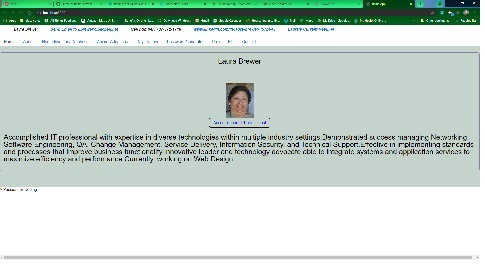

# 20 React: React Portfolio

-----------------------------------------

## Table of Contents

* [Title](#Title:)
* [Task](#Task)
* [Link to GitHub repository](#Link-to-GitHub-repository)
* [picture of page](#picture-of-page:)

-----------------------------------------

## Description

AN employer looking for candidates with experience building single-page applications
To view a potential employee's deployed React portfolio of work samples,
so that they can assess whether they're a good candidate for an open position.

------------------------------    
### Title

React Portfolio

--------------------------------------------------------------------------------
### Task

The task was to create a portfolio using your new React skills, which will help set you apart from other developers whose portfolios don’t use the latest technologies. 

This website displays four of my projects with description and picture of each.

Included are the links to the repositories for each and a picture of the main page of each.

--------------------------------------------------------------------------------
### Link to GitHub repository 

https://github.com/ljbrewer/ReactPortfolio

--------------------------------------------------------------------------------
### picture of page:

-------------------------------------------------------------------------------
### Link to Application

TBD
--------------------------------------------------------------------------------
#### Credits: 

This program was created by Laura Brewer